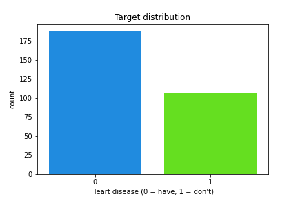
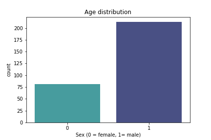
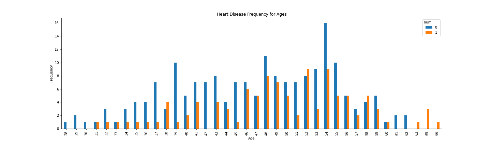
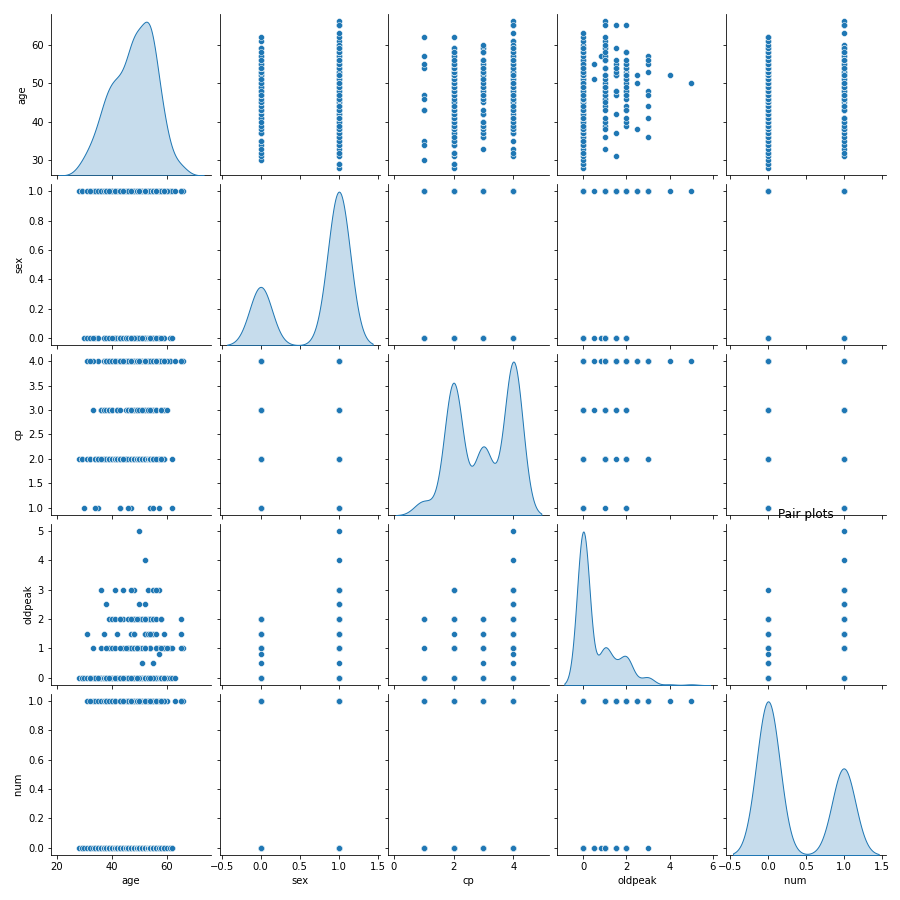
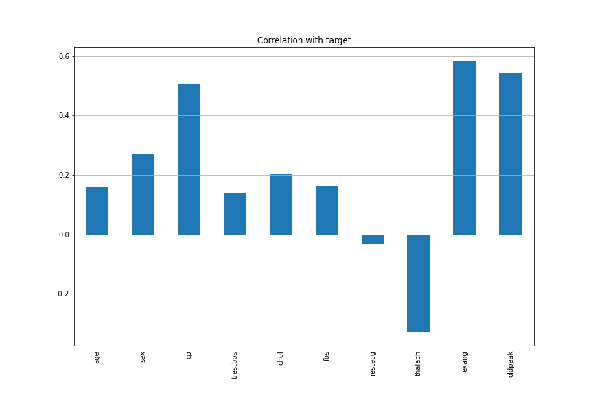

# Quantum Open Source Foundation project
Hello world, this is my quantum open source project on building a quantum variational classifier using the heart attack dataset. This will be a series of blogs in the order of:
1. Classical preprocessing, `this one`
2. Explaining the workings of a variational quantum model
3. Explain my finds and look at the best models
4. Characterising loss landscapes

My goal through this project are:
- Learn how variational circuit work
- Explore the different types of optimizers
- Get a firm understaning on quantum machine learning
- explore the loss landscape of variational models

My project plan is to ;
1. Explore the data and preprocessing it.
2. Create quantum neural network, combine featuremap, variational circuit and measurement parts
3. Explore different types of optimizers, featuremaps, depths of featuremaps and depths of variational circuit.
4. Explain my observations based on the first 10 model configs.
5. Characterise the loss landscape of the best models.

These are some of my finds and I hope we share the same idea about them. 

# Exploratory Data Analysis

Exploratory Data Analysis (EDA) refers to the critical prcess of performing initial investigations on a dataset so as to dicover patterns, spot anomalies, test hypothesis and check assumptions.
It it usually a good practise in data science to explore the data first before getting your hand dirty and starting to build models.

My EDA process was short as the series topic alluded earlier, I would like to focus on Quantum Machine Learning rather than dwell on data science.

## Data explorations
To start of we imported necessary libraries, pandas, numpy, matplotlib, seaborn and pandas profiling and loaded our dataset

```python
data = pd.read_csv(DATA_PATH)
```

The original dataset can be found [here](https://www.kaggle.com/imnikhilanand/heart-attack-prediction). 

We then check the shape of the datset and find we have 14 columns that is 13 features and one target variable. We have 294 rows that is we have 294 datapoint on which we will use to train our model.
When we check our columns we see the actual names. The explanations of the each columns is:

```python
print(data.columns)

Index(['age', 'sex', 'cp', 'trestbps', 'chol', 'fbs', 'restecg', 'thalach', 'exang', 'oldpeak', 'slope', 'ca', 'thal', 'num       '], dtype='object')

```

**Attribute Information**
- Age (age in years)
- Sex (1 = male; 0 = female)
- CP (chest pain type)
- TRESTBPS (resting blood pressure (in mm Hg on admission to the hospital))
- CHOL (serum cholestoral in mg/dl)
- FPS (fasting blood sugar > 120 mg/dl) (1 = true; 0 = false)
- RESTECH (resting electrocardiographic results)
- THALACH (maximum heart rate achieved)
- EXANG (exercise induced angina (1 = yes; 0 = no))
- OLDPEAK (ST depression induced by exercise relative to rest)
- SLOPE (the slope of the peak exercise ST segment)
- CA (number of major vessels (0-3) colored by flourosopy)
- THAL (3 = normal; 6 = fixed defect; 7 = reversable defect)
- num ==> TARGET (1 or 0)

when we check the head of the data we see some missing values labeled `?`. We will try and fix this later. We proceed and check the info of the data and see most columns are under dtype `object` instead of `float64`. We will try and fix this later on.

We then check the unique values of each columns
```python
def check_unique(df):
    """"
    Checks the unique value in each column
    :param df: The dataframe
    """
    for col in df.columns:
        unique = df[col].unique()
        print("Column: {} has {} unique values\n".format(col, unique))

```
We see that sex, cp , fbs, exang, oldpeak, slope, ca , thal and num are categorical variables while the others are continuous. This will help us when deciding which values to fill in the null spaces



When we look at the target distribution we can see that they are almost balanced since one of the classes isn't more than 2/3 of the dataset.



When we look at the age distribution we see that most of the people are male

 

We can definitely see ad you age you are more prone to heart attack until age of 57 where your chances start reducing. At the age of 54 is the age where most people are liable to heart attack.



This pairplot shows us the distributionof every class.

## Data cleaning
1. We first change the column name or the target variables as it has ore spaces

```python
data = data.rename(columns={'num       ':'num'})
```
2. We then change the `?` in the data to be `np.Nan` since they are null values.

```python
def fix_missing_values(df):
    """"
    Changes ? in the data to be np.Nan
    :param df: The dataframe
    :return df: Fixed dataframe
    """
    
    cols = df.columns
    for col in cols:
        for i in range(len(df[col])):
            if df[col][i] == '?':
                df[col][i] = np.NaN
    return df
```
3. We change the data tyoe of the `object` to `float64`

```python
def change_dtype(df):
    """"
    Changes the data type from object to float64
    :param df: The dataframe
    :return df: Fixed dataframe
    """    
    cols = df.columns
    for col in cols:
        if df[col].dtype == 'O':
            df[col] = df[col].astype("float64")
    return df
```
4. Fixing mixing values

We will delete the columns with more than a half or its members empty
- ca
- thal
- slope

This we wil fix with the mean value since the value random values
- trestbps
- chol
- thalach

This we will fix with the mode value since they are either `0` or `1`
- fbs
- exang
- restecg

```python
def fix_missing_values(df):
    """"
    Fixes the missing values by either deleting or replacing
    :param df: The dataframe
    :return df: Fixed dataframe
    """
    def delete_missing_values(df):
        """
        Deletes the column with Null values which are less than half of its values
        """
        df = df[['age', 'sex', 'cp', 'trestbps', 'chol', 'fbs', 'restecg', 'thalach','exang', 'oldpeak', 'num']]
        return df
    def fill_with_mean(df):
        """
        Fills the NaN values with the mean value of the column
        """
        cols = ['trestbps', 'chol', 'thalach']
        for col in cols:
            df[col].fillna(value=df[col].mean(), inplace=True)
        return df
    def fill_with_mode(df):
        """
        Fills the NaN values with the mode value of the column
        """
        cols =['fbs', 'restecg', 'exang']
        for col in cols:
            df[col].fillna(value=df[col].mode()[0], inplace=True)
        return df
    df = delete_missing_values(df)
    df = fill_with_mean(df)
    df = fill_with_mode(df)
    return df
```
5. We remove duplicate rows

```python
data.drop_duplicates(inplace=True)
```

## Profiling
We first check the correlation of the columns to th target variable
```python
data.drop('num', axis=1).corrwith(data['num']).plot(kind='bar', grid=True, figsize=(12, 8), title="Correlation with target")

```



We see that exang has the highest prositive correlation followed by oldpeak and then cp. Thalach has the highest negative correlations.

This 4 features are the ones we will use as the other ones have little impact on the target variable. 

We finish of by checking the pandas profiling

```python
pp.ProfileReport(df=data, dark_mode=True, explorative=True)
```

From the overview we are able to see we have to warnings which we will ignore.
1. `df_index` has unique values. This is beacues it is the index column so it has all unique values
2. `oldpeak` has 188 (64.2%) zeros. The data is not normalized hence most values are 0


## Next steps
1. We shuffle the data to introduce some randomness: we maintain the same random state for all operations
2. We remove less relevant features and remain with the top 4 features, 3 postively correlated with the target variable and 1 negatively correlated with the target variable.
3. We normalize the data using `sklearn.preprocessing.MinMaxScaler` between ranges $-2\pi$ and $2\pi$. This is to ensure we utilize most of the Hilbert space as we will be encoding the data into quantum states.
4. We finally split the data into train and test sets, keeping the test size to 0.3

```python
def normalize_data(dataPath="../../Data/Processed/data.csv"):
    data = pd.read_csv(dataPath)
    data = shuffle(data, random_state=42)
    X, Y = data[['sex', 'cp', 'exang', 'oldpeak']].values, data['num'].values
    # normalize the data
    scaler = MinMaxScaler(feature_range=(-2 * np.pi, 2 * np.pi))
    X = scaler.fit_transform(X)
    X_train, X_test, Y_train, Y_test = train_test_split(X, Y, test_size=0.3, random_state=42)
    return X_train, X_test, Y_train, Y_test
```

# Lets move to the next blog, Explaining the workings of a variational quantum model