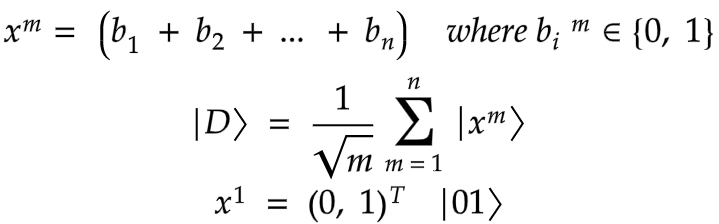
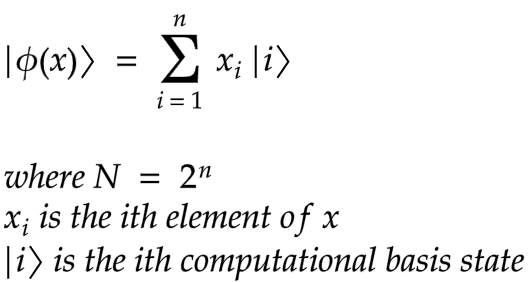
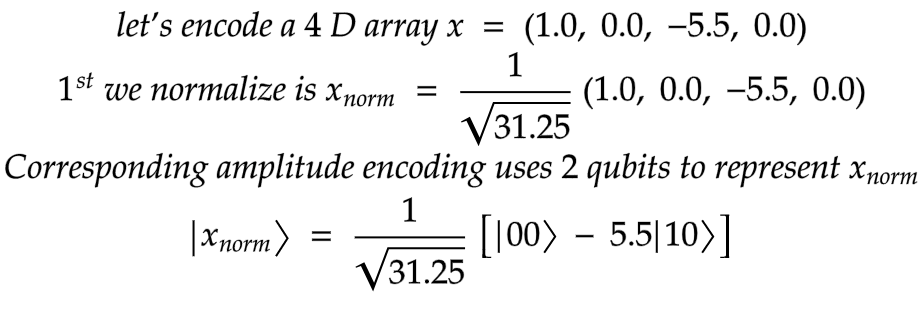

# EXPLAINING VARIATIONAL QUANTUM CLASSIFIERS

Quantum machine learning are computational machine learning models which are based on the principles of quantum mechanics. A typical quantum machine learning involves combining classical machine learning models with the advantages of quantum information in order to develop more efficient algorithms. One important motivation for these investigations is the difficulty to train classical neural networks, especially in big data applications. The hope is that features of quantum computing such as quantum parallelism or the effects of interference and entanglement can be used as resources. 

Most Quantum machine learning are developed as feed-forward networks. Similar to their classical counterparts, this structure intakes input from one layer of qubits gate, and passes that input onto another qubits gate. This layer of qubits evaluates this information and passes on the output to the next layer, evolving the state of the qubit. Eventually the path leads to the final layer of qubits. 

For example a variational quantum circuit is a parameterized quantum circuit which can be trained by training the parameters of the quantum circuit, qubit rotations and the measurement of this circuit will approximate to a quantity of interest with reference. 

Machine learning techniques are built around:
1. An adaptable system that allows approximation
2. Calculation of a loss function in the output layer
3. Way to update the network continuously to minimise loss function

We hope that the process is cheaper on a quantum computer and also preparing quantum states is faster/cheaper than performing matrix products on CPU and GPU. To pursue this task using quantum machine learning, we construct a novel hybrid neural network, based on a quantum variational classifier. Quantum variational classifiers are known to have an advantage in model size compared to classical neural networks

Given a dataset about patient's information can we predict if he is likely going to have heart attack or no.This is a binary classification problem, with an input real vector $x$ and a binary output $y$ in $\{0, 1\}$. We want then to build a quantum circuit whose output is a quantum state 

## PROCESS
This is achieved by designing a quantum circuit that behaves similarly to a traditional machine learning algorithm. The quantum machine learning algorithm contains a circuit which depends on a set of parameters that, through training, will be optimised to reduce the value of a loss function.

*From swissquantumhub*

1. State preparation
2. Model circuit
3. Measurement

### 1. Data Encoding, state preparation
When we want to encode our classical data into quantum states we perform certain operations to help us work with the data in quantum circuits. One of the step is called data embedding which is the representation of classical data as a quantum state in Hilbert space via a quantum feature map. A feature map is the mathematical map that helps us embed our data into quantum states. It is usually a variational quantum circuit in which the parameters depend on the input which for our case is the classical data. We will need to define a variational quantum circuit before going any further. A variational quantum circuit is a quantum algorithm that depends on paramters and can there for be optimised by either classical or quantum methods.

#### Data embedding
For data embedding we take out classical datapoint, x and make it into a set of paramters of a quantum gate in a quantum circuit hence creating out desirable quantum state.
$x \rightarrow \left| \phi(x) \right\rangle $
Examples of data embedding methods

##### 1. Basis embedding
In this method we simply encode our data into binary strings. We convert each input to a computational basis state of a qubit system. For example ${x = 1001}$ is represented by a 4 qubit system as $\left| 1001 \right\rangle$ quantum state. It is
- amplitude vectors become sparse
- most freedom to do computation
- schemes not efficient

##### 2. Amplitude embedding
We encode the data as amplitudes of a quantum state. A normalized classical N - dimensional datapoint ${x}$ is represented by the amplitudes of a n-qubit quantum state $\left| \phi ( x)\right\rangle$ as 

For example

This is: 
- simple, intuitive
- inexpensive

##### 3. Angle embedding
Here, we use the so-called angle encoding. Practically, this amounts to using the input data, x, as angles in a unitary quantum gate. We take the state preparation circuit as the unitary gate

##### 4. Higher order embedding
It converts a 2D data point into a 3D data point

##### 5. Hamiltonian embedding
It encodes the classical data in the evolution of a quantum systems

Continuous variables are encoded using squeezing and displacement embedding.

#### Feature maps
Feature maps allow you to map data into a higher dimensionsal Hilbert Space. This allows you to perform computation over non-linear basic functions. This encodes our classical data $x_i$ into quantum states $\left|\phi(x_i)\right\rangle$. Using parameterized quantum circuits implies using exponential number of functions with respect to the no of qubit from the parameter circuit. We use three different types of featuremaps, ZZFeaturemap, ZFeaturemap and PauliFeaturemap. We varied the depths of these featuremaps (1, 2, 4) in order to check on the model accuracy.

*Pauli feature map*

*ZZ feature map*

*Z feature map*

### 2. Model circuit
The second step is the model circuit, or the classifier strictly speaking. A parameterized unitary operator $U (\theta)$ is created such that $\left| \psi(x: \theta)\right\rangle = U(\theta) \left| \psi(x)\right\rangle$ . The model circuit is constructed from gates that evolve the input state. The circuit is based on unitary operations and depends on external parameters which will be adjustable. Given a prepared state $\left| \psi_i\right\rangle$ the model circuit, $U (w)$ maps $\left| \psi_i\right\rangle$ to another vector $\left| \psi_i\right\rangle = U(w)\left| \psi_i\right\rangle$.  In turn $U(w)$ consists of a series of unitary gates.

We used the RealAmplitudes variational circuit from qiskit.

*Real Amplitudes*

### 3. Measurement
The final step is the measurement step, which estimates the probability of belonging to a class by performing several measurements. It’s the equivalent of sampling multiple times from the distribution.

The final circuit has `ZZFeatureMap` with a depth of 1 and a variational form `RealAmplitudes` with a depth of 1.

*Overall circuit*

#### Training
As alluded to above, during training we aim to find the values of weights and biases to optimise a
given loss function. We can perform optimisation on a quantum neural network similar to how it is done on a classical neural network. In both cases, we perform a forward pass of the model and calculate a loss function. We can then backpropagate over the network and update our trainable parameters. During training we use the mean squared error (MSE) as loss function. This allows
us to find a distance between our predictions and truth, represented by the value of the loss function.

We will train our model using Adam, COBYLA and SPSA optimizers. 

##### 1. Adam
Known as the Adaptive Moment Estimation Algorithm, but abbreviated Adam. This algorithm simply estimates moments and uses them to optimize a function. It is essentially a combination of the gradient descent with momentum algorithm and the RMS (Root Mean Square) Prop algorithm.
The Adam algorithm calculates an exponential weighted moving average of the gradient and then squares the calculated gradient. This algorithm has two decay parameters that control the decay rates of these calculated moving averages.

##### 2. COBYLA
Known as Constrained Optimization by Linear Approximations. It constructs successive linear approximations of the objective function and constraints via a simplex of n+1 points (in n dimensions), and optimizes these approximations in a trust region at each step. COBYLA supports equality constraints by transforming them into two inequality constraints. 

##### 3. SPSA
SPSA uses only objective function measurements. This contrasts with algorithms requiring direct measurements of the gradient of the objective function. SPSA is especially efficient in high-dimensional problems in terms of providing a good solution for a relatively small number of measurements of the objective function. The essential feature of SPSA, which provides its power and relative ease of use in difficult multivariate optimization problems, is the underlying gradient approximation that requires only two objective function measurements per iteration regardless of the dimension of the optimization problem. These two measurements are made by simultaneously varying in a "proper" random fashion all of the variables in the problem (the "simultaneous perturbation"). This contrasts with the classical ("finite-difference") method where the variables are varied one at a time. If the number of terms being optimized is p, then the finite-difference method takes 2p measurements of the objective function at each iteration (to form one gradient approximation) while SPSA takes only two measurements. 

**The code can be found at [code](https://github.com/0x6f736f646f/variational-quantum-classifier-on-heartattack)**