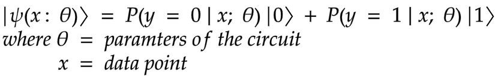

# Variational Quantum Classifier

By now you know how a variational quantum classifier works. The code for the previous series is at [Github repo](https://github.com/0x6f736f646f/variational-quantum-classifier-on-heartattack)


## Introduction
In binary classification, let's say labelling if someone is likely to have heart attack or not , we build a function that takes in the information about the patient and gives results possible to the reality. E.g, $f(information) = P(hear attack = YES)$. This probabilistic way is well suited for quantum computing and we would like to build a quantum states $\left| \psi \right\rangle$ such that $\left| \psi(information)\right\rangle = P(heart attack = YES) \left| 0\right\rangle + P(heart attack = NO) \left| 1\right\rangle$. We then compute the outcome via quantum measurement. By optimising the circuits you then finding parameters that will give the closest probability to the reality. 

## Problem statement
Given a dataset about patient's information can we predict if he is likely going to have heart attack or no.This is a binary classification problem, with an input real vector ${x}$ and a binary output ${y}$ in $\{0, 1\}$. We want then to build a quantum circuit whose output is a quantum state 


## Procedure
This is achieved by designing a quantum circuit that behaves similarly to a traditional machine learning algorithm. The quantum machine learning algorithm contains a circuit which depends on a set of parameters that, through training, will be optimised to reduce the value of a loss function.


*From swissquantumhub*

The proposed algorithm is composed of 3 steps:
1. State preparation
2. Model circuit
3. Measurement

Implementation
1. We initialise our circuit with Zero state and multiply it with number of qubits
```python
self.sv = Statevector.from_label('0' * self.no_qubit)
```
2. We use a higher order feature map, `ZZFeaturemap, ZFeaturemap and PauliFeaturemap` and specify the number of qubits and also how many repetions we want, 1, 3, 5.

3. We specify the variational from as `RealAmplitude` and specify the number of qubits and also how many repetions we want, 1, 2, 4.

4. We then combine our feature map to the variational quantum circuit.
`ZZfeaturemap and RealAmplitudes both with a depth of 1`
```python
def prepare_circuit(self):
    """
    Prepares the circuit. Combines an encoding circuit, feature map, to a variational circuit, RealAmplitudes
    :return:
    """
    self.circuit = self.feature_map.combine(self.var_form)
```
5. We create a function to that associates the parameters of the feature map with the data and the parameters of the variational circuit with the parameters passed
```python
def get_data_dict(self, params, x):
    """
    Assign the params to the variational circuit and the data to the featuremap
    :param params: Parameter for training the variational circuit
    :param x: The data
    :return parameters:
    """
    parameters = {}
    for i, p in enumerate(self.feature_map.ordered_parameters):
        parameters[p] = x[i]
    for i, p in enumerate(self.var_form.ordered_parameters):
        parameters[p] = params[i]
    return parameters

```


6. We create another functions that checks the parity of the bit string passed. hence if the parity is even it returns a yes and if the parity is odd it returns a no
```python
def assign_label(self, bit_string):
    """
    Based on the output from measurements assign no if it odd parity and yes if it is even parity
    :param bit_string: The bit string eg 00100
    :return class_label: Yes or No
    """
    hamming_weight = sum([int(k) for k in list(bit_string)])
    is_odd_parity = hamming_weight & 1
    if is_odd_parity:
        return self.class_labels[1]
    else:
        return self.class_labels[0]
```
7.  We create another functions that returns the probability distribution over the model classes
```python
def return_probabilities(self, counts):
    """
    Calculates the probabilities of the class label after assigning the label from the bit string measured
    as output
    :type counts: dict
    :param counts: The counts from the measurement of the quantum circuit
    :return result: The probability of each class
    """
    shots = sum(counts.values())
    result = {self.class_labels[0]: 0, self.class_labels[1]: 0}
    for key, item in counts.items():
        label = self.assign_label(key)
        result[label] += counts[key] / shots
    return result
```
8.   We create another functions that classifies our data. It takes in data and parameters. For every data point in the dataset we assign the parameters to the feature map and the parameters to the variational circuit. We then evolve our system and store the quantum circuit. We then measure each circuit and return the probabilities based on the bit string and class labels
```python
def classify(self, x_list, params):
    """
    Assigns the x and params to the quantum circuit the runs a measurement to return the probabilities
    of each class
    :type params: List
    :type x_list: List
    :param x_list: The x data
    :param params: Parameters for optimizing the variational circuit
    :return probs: The probabilities
    """
    qc_list = []
    for x in x_list:
        circ_ = self.circuit.assign_parameters(self.get_data_dict(params, x))
        qc = self.sv.evolve(circ_)
        qc_list += [qc]
        probs = []
    for qc in qc_list:
        counts = qc.to_counts()
        prob = self.return_probabilities(counts)
        probs += [prob]
    return probs
```

## Results
Data classification was performed by using the implemented version of VQC in IBM’s framework and executed on the provider simulator 
```python
qiskit==0.23.1
qiskit-aer==0.7.1
qiskit-aqua==0.8.1
qiskit-ibmq-provider==0.11.1
qiskit-ignis==0.5.1
qiskit-terra==0.16.1
```

Every combination of the experiments were executed 1024 shots, using the implemented version of the optimizers. We conducted tests with different number of feature map depth, variational depth and optimizers. In each case we compared the accuracy and loss. Our best configs were 
```python
ZFeatureMap(4, reps=2) SPSA(max_trials=50) vdepth 5 : Cost: 0.13492279429495616
ZFeatureMap(4, reps=2) SPSA(max_trials=50) vdepth 3 : Cost: 0.13842958846394343
ZFeatureMap(4, reps=2) COBYLA(maxiter=50) vdepth 3 : Cost: 0.14097642258192988
ZFeatureMap(4, reps=2) SPSA(max_trials=50) vdepth 1 : Cost: 0.14262128997684975
ZFeatureMap(4, reps=1) COBYLA(maxiter=50) vdepth 1 : Cost: 0.1430145495411656
ZZFeatureMap(4, reps=1) SPSA(max_trials=50) vdepth 5 : Cost: 0.14359757088670677
ZFeatureMap(4, reps=2) COBYLA(maxiter=50) vdepth 5 : Cost: 0.1460568741051525
ZFeatureMap(4, reps=1) SPSA(max_trials=50) vdepth 3 : Cost: 0.14830080135566964
ZFeatureMap(4, reps=1) SPSA(max_trials=50) vdepth 5 : Cost: 0.14946706294763648
ZFeatureMap(4, reps=1) COBYLA(maxiter=50) vdepth 3 : Cost: 0.15447151389989414}
```

## Conclusion
Heart attack is a major concern in public health, therefore several research efforts have been conducted including topics that are addressed using statistics, data mining and machine learning techniques. Every year more data is becoming available from the increased diagnosis rate. The data availability has lead to the emergence from Machine learning methods, which are nowadays an extremely valuable tool for healthcare professionals to understand and mitigate this and
other conditions. The next stage will continue to explore the different loss landscapes of our top 5 models. In general, VQC results demonstrate that it is a promising technique
when quantum devices grown its capabilities, attending the future necessities of
the healthcare system.