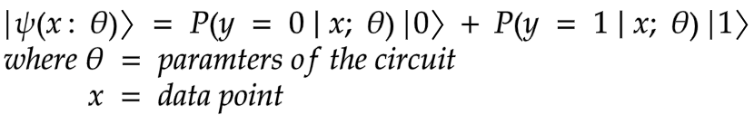
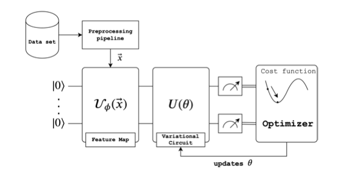
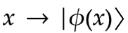
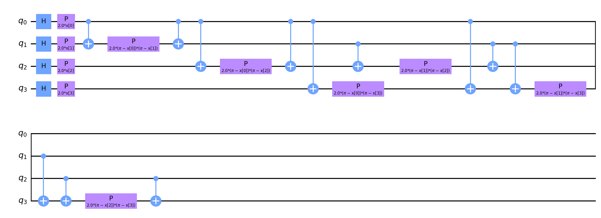
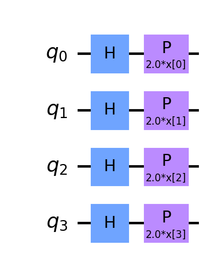
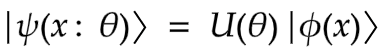
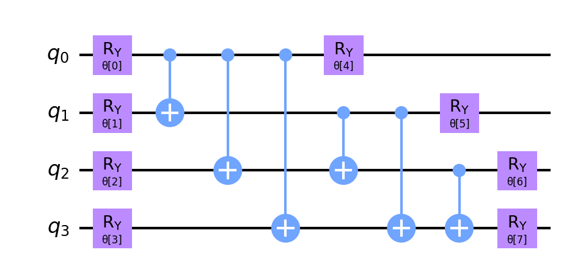
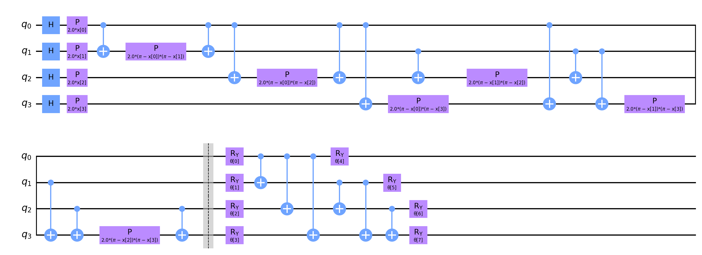
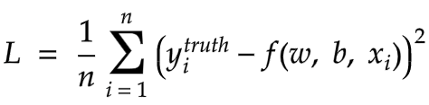
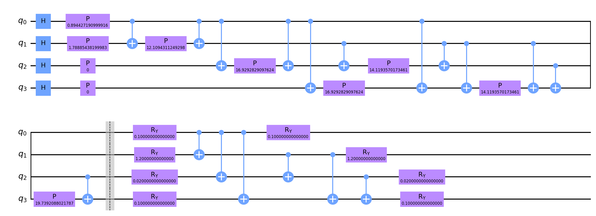

# My Quantum Open Source Foundation Project
Hello world, I'm Rodney Osodo. An undergrad student at Jomo Kenyatta University of Agriculture and Technology in Kenya. I've been interested in quantum computing for a while now and am so excited to share my learnings from my most recent experience with quantum computing.

This is my quantum open source foundation project on building a quantum variational classifier using a heart attack dataset. The purpose of this project was to help me gain insight into the actual construction of a quantum model, applied to real data. By sharing these insights, I hope to help many of you understand and learn much of the dynamics accompanied with quantum machine learning, which I grasped whilst doing this project. This will be a series of blogs in the order of:
1. Classical preprocessing of data, `this one`
2. Explaining the workings of a variational quantum model
3. Explain my finds and look at the best models


My project plan is to:
1. Explore a specific dataset and preprocess it. For this project, we decided to use the heart attack data as our baseline. This is because, in medical aspects, heart attack is the leading disease that causes death. In computation aspect, the data was rather small and could easily be fitted on NISQ computers. We also used the iris dataset and wine datasets for validation.
2. Create a quantum neural network (AKA variational classifier) by combining a featuremap, variational circuit and measurement component (don't worry, I will explain what these components mean in detail).
3. Explore different types of optimizers, featuremaps, depths of featuremaps and depths of the variational circuit.
4. Explain my observations based on the best 10 model configurations.
5. Try to understand why these models performed the best and see if they are able to generalise well on new data.


# Exploratory Data Analysis

Exploratory Data Analysis (EDA) refers to the critical prcess of performing initial investigations on a dataset so as to dicover patterns, spot anomalies, test hypotheses and check assumptions. It it usually good practice in data science to explore the data first before getting your hands dirty and starting to build models.

My EDA process was short as the series topic alluded earlier, I would like to focus on quantum machine learning rather than dwell on data science!

Finally We shuffled the data to introduce some randomness, we remove less relevant features and remain with the top 4 features, we normalize the data using `sklearn.preprocessing.MinMaxScaler` between ranges $-2\pi$ and $2\pi$. This is to ensure we utilize the Hilbert space appropriately as we will be encoding the data into quantum states via rotation angles and we split the data into train and test sets, keeping the test size to 0.3 which is rather standard in classical machine learning.


# Explaining Variational Quantum Classifiers

For this point onwards we will be using the qiskit framework to do our quantum computing. Quantum machine learning usually involves machine learning that runs on quantum computers. A typical quantum machine learning model is composed of 2 parts, a classical part for pre- and post-processing data and a quantum part for harnessing the power of quantum mechanics to perform certain calculations easier, such as solving extremely large systems of linear equations. One of the main motivations for using quantum machine learning is because it is difficult to train very large machine learning models on huge datasets. The hope is that features of quantum computing, such as quantum parallelism or the effects of interference and entanglement, can be used as resources. 


A quantum neural network has many definitions in literature, but can broadly be thought of as a quantum circuit with trainable parameters. These quantum models are referred to as variational quantum circuits. With this, we can finally define a quantum neural network as a variational quantum circuit - a parameterised quantum circuit that can be optimized by training the parameters of the quantum circuit, which are qubit rotations, and the measurement of this circuit will approximate the quantity of interest - i.e. the label for the machine learning task. 


We hope that any part of this process is better on a quantum computer. To pursue the task of classification using quantum machine learning, we construct a hybrid neural network based on a quantum variational classifier. Quantum variational classifiers are suggested to have an advantage over certain classical models through a higher effective dimension and faster training ability.

Given a dataset about patient's information, can we predict if they are likely to have a heart attack or not. This is a binary classification problem, with a real input vector $x$ and a binary output $y$ in $\{0, 1\}$. We want to build a quantum circuit whose output is a quantum state 


## Process
This is achieved by designing a quantum circuit that behaves similarly to a traditional machine learning algorithm. The quantum machine learning algorithm contains a circuit which depends on a set of parameters that, through training, will be optimised to reduce the value of a loss function.

*From swissquantumhub*

In general, there are three steps to this type of quantum machine learning model:
1. State preparation
2. Model circuit
3. Measurement

### 1. Data encoding/state preparation
When we want to encode our classical data into quantum states, we perform certain operations to help us work with the data in quantum circuits. One of the steps is called data embedding which is the representation of classical data as a quantum state in Hilbert space via a quantum feature map. A feature map is a mathematical mapping that helps us embed our data into (usually) higher dimensional spaces, or in this case, quantum states. It can be thought of as a variational quantum circuit in which the parameters depend on the input data, which for our case is the classical heart attack data. We will need to define a variational quantum circuit before going any further. Recall that a variational quantum circuit depends on parameters that can be optimised by classical methods.

For embedding we take a classical data point, $x$, and encode it by applying a set of gate parameters in the quantum circuit where gate operations depend on the value of $x$, hence creating the desired quantum state:



Here are some examples of well known data embedding methods:


#### Feature maps
Feature maps allow you to map data into a higher dimensional space. The input data is encoded in a quantum state via a quantum
feature map, an encoding strategy that maps data to quantum Hilbert space. A quantum computer can analyse the input data in this feature space, where a classifier aims to find a hyperplane to separate the data. 

Feature maps encode our classical data $x_i$ into quantum states $\left|\phi(x_i)\right\rangle$. In this analysis, we use three different types of featuremaps precoded in the Qiskit circuit library, namely ZZFeaturemap, ZFeaturemap and PauliFeaturemap. We varied the depths of these featuremaps (1, 2, 4) in order to check the different models' performance. By increasing a feature map's depth, we introduce more entanglement into the model and repeat the encoding circuit.

*Pauli feature map*


*ZZ feature map*


*Z feature map*

### 2. Model circuit
The second step is the model circuit, or the classifier strictly speaking. A parameterised unitary operator $U(w)$ is created such that 



$\left| \psi(x: \theta)\right\rangle = U(w) \left| \psi(x)\right\rangle$ .

The model circuit is constructed from gates that evolve the input state. The circuit is based on unitary operations and depends on external parameters which will be adjustable. Given a prepared state $\left| \psi_i\right\rangle$ the model circuit, $U(w)$ maps $\left| \psi_i\right\rangle$ to another vector $\left| \psi_i\right\rangle = U(w)\left| \psi_i\right\rangle$.  In turn $U(w)$ consists of a series of unitary gates.

We used the RealAmplitudes variational circuit from Qiskit for this. Increasing the depth of the variational circuit introduces more trainable parameters into the model.


*Real Amplitudes*


### 3. Measurement
The final step is the measurement step, which estimates the probability of belonging to a class by performing certain measurements. It’s the equivalent of sampling multiple times from the distribution of possible computational basis states and obtaining an expectation value.

For demonstration purposes I made some design considerations. I chose the final circuit to have `ZZFeatureMap` with a depth of 1 and a variational form `RealAmplitudes` with a depth of 1. This is to make a simple illustration of how the full model works. 

*Overall circuit*



#### Training
As alluded to above, during training we aim to find the values of parameters to optimise a given loss function. We can perform optimisation on a quantum model similar to how it is done on a classical neural network. In both cases, we perform a forward pass of the model and calculate a loss function. We can then update our trainable parameters using gradient based optimisation methods since the gradient of a quantum circuit is possible to compute. During training we use the mean squared error (MSE) as loss function. This allows us to find a distance between our predictions and the truth, captured by the value of the loss function.

We will train our model using ADAM, COBYLA and SPSA optimizers. Below is a brief explanation of these optimizers, but I encourage you to read a bit further on their pros/cons.


**The code can be found at [code](https://github.com/0x6f736f646f/variational-quantum-classifier-on-heartattack)**


## Implementation
1. We initialise our circuit in the zero state (all qubits in state zero)
```python
self.sv = Statevector.from_label('0' * self.no_qubit)
```
2. We use a feature map such as, `ZZFeaturemap, ZFeaturemap` or `PauliFeaturemap` and choose the number of qubits based on the input dimension of the data and how many repetitions (i.e. the circuit depth) we want. We use 1, 3, 5.

3. We choose the variational form as `RealAmplitudes` and specify the number of qubits as well as how many repetitions we want. We use 1, 2, 4 to have models with an increasing number of trainable parameters.

4. We then combine our feature map to the variational circuit.
`ZZfeaturemap and RealAmplitudes both with a depth of 1`
```python
def prepare_circuit(self):
    """
    Prepares the circuit. Combines an encoding circuit, feature map, to a variational circuit, RealAmplitudes
    :return:
    """
    self.circuit = self.feature_map.combine(self.var_form)
```
5. We create a function that associates the parameters of the feature map with the data and the parameters of the variational circuit with the parameters passed. This is to ensure in Qiskit that the right variables in the circuit are associated with the right quantities.
```python
def get_data_dict(self, params, x):
    """
    Assign the params to the variational circuit and the data to the featuremap
    :param params: Parameter for training the variational circuit
    :param x: The data
    :return parameters:
    """
    parameters = {}
    for i, p in enumerate(self.feature_map.ordered_parameters):
        parameters[p] = x[i]
    for i, p in enumerate(self.var_form.ordered_parameters):
        parameters[p] = params[i]
    return parameters

```




6. We create another function that checks the parity of the bit string passed. If the parity is even, it returns a 'yes' label and if the parity is odd it returns a 'no' label. We chose this since we have 2 classes and parity checks either returns true or false for a given bitstring. There are also other methods e.g for 3 classes you might convert the bistring to a number and pass is through an activation function. Or perhaps interpret the expectation values of a circuit as probabilities. The important thing to note is that there are multiple ways to assign labels from the output of a quantum circuit and you need to justify why or how you do this. In our case, the parity idea was originally motivated in this very nice paper (https://arxiv.org/abs/1804.11326) and the details are contained therein.
```python
def assign_label(self, bit_string):
    """
    Based on the output from measurements assign no if it odd parity and yes if it is even parity
    :param bit_string: The bit string eg 00100
    :return class_label: Yes or No
    """
    hamming_weight = sum([int(k) for k in list(bit_string)])
    is_odd_parity = hamming_weight & 1
    if is_odd_parity:
        return self.class_labels[1]
    else:
        return self.class_labels[0]
```
7.  Now we create a function that returns the probability distribution over the model classes. After measuring the quantum circuit multiple times (i.e. with multiple shots), we aggregate the probabilites associated with 'yes' and 'no' respectively, to get probabilities for each label.
```python
def return_probabilities(self, counts):
    """
    Calculates the probabilities of the class label after assigning the label from the bit string measured
    as output
    :type counts: dict
    :param counts: The counts from the measurement of the quantum circuit
    :return result: The probability of each class
    """
    shots = sum(counts.values())
    result = {self.class_labels[0]: 0, self.class_labels[1]: 0}
    for key, item in counts.items():
        label = self.assign_label(key)
        result[label] += counts[key] / shots
    return result
```
8.   Finally, we create a function that classifies our data. It takes in data and parameters. For every data point in the dataset we assign the parameters to the feature map and the parameters to the variational circuit. We then evolve our system and store the quantum circuit. We store the circuits so as to run them at once at the end. We measure each circuit and return the probabilities based on the bit string and class labels.
```python
def classify(self, x_list, params):
    """
    Assigns the x and params to the quantum circuit the runs a measurement to return the probabilities
    of each class
    :type params: List
    :type x_list: List
    :param x_list: The x data
    :param params: Parameters for optimizing the variational circuit
    :return probs: The probabilities
    """
    qc_list = []
    for x in x_list:
        circ_ = self.circuit.assign_parameters(self.get_data_dict(params, x))
        qc = self.sv.evolve(circ_)
        qc_list += [qc]
        probs = []
    for qc in qc_list:
        counts = qc.to_counts()
        prob = self.return_probabilities(counts)
        probs += [prob]
    return probs
```

## Results
Data classification was performed by using the implemented version of VQC in IBM’s framework and executed on the provider simulator 
```python
qiskit==0.23.1
qiskit-aer==0.7.1
qiskit-aqua==0.8.1
qiskit-ibmq-provider==0.11.1
qiskit-ignis==0.5.1
qiskit-terra==0.16.1
```

Every combination of the experiments were executed with 1024 shots, using the implemented version of the optimizers. We conducted tests with different feature maps and depths, the RealAmplitudes variational form with differing depths and different optimizers in Qiskit. In each case, we compared the loss values after 50 training iterations on the training data. Our best model configs were 
```python
ZFeatureMap(4, reps=2) SPSA(max_trials=50) vdepth 5 : Cost: 0.13492279429495616
ZFeatureMap(4, reps=2) SPSA(max_trials=50) vdepth 3 : Cost: 0.13842958846394343
ZFeatureMap(4, reps=2) COBYLA(maxiter=50) vdepth 3 : Cost: 0.14097642258192988
ZFeatureMap(4, reps=2) SPSA(max_trials=50) vdepth 1 : Cost: 0.14262128997684975
ZFeatureMap(4, reps=1) COBYLA(maxiter=50) vdepth 1 : Cost: 0.1430145495411656
ZZFeatureMap(4, reps=1) SPSA(max_trials=50) vdepth 5 : Cost: 0.14359757088670677
ZFeatureMap(4, reps=2) COBYLA(maxiter=50) vdepth 5 : Cost: 0.1460568741051525
ZFeatureMap(4, reps=1) SPSA(max_trials=50) vdepth 3 : Cost: 0.14830080135566964
ZFeatureMap(4, reps=1) SPSA(max_trials=50) vdepth 5 : Cost: 0.14946706294763648
ZFeatureMap(4, reps=1) COBYLA(maxiter=50) vdepth 3 : Cost: 0.15447151389989414
```
From the results, the ZFeatureMap with a depth of 2, RealAmplitudes variational form with a depth of 5 and the SPSA optimizer achieved the lowest cost. These results seem to indicate that the feature map which resulted in a lower cost function generally was the ZFeatureMap. But does this mean that the ZFeaturemap typically performs better in general? 

## Questions
#### 1. Does increasing the variational form depth increase convergence?
- Interestingly, increasing the depth of the variational form does not seem to increase convergence of any of these models substantially. Note that increasing the variational form's depth implies introducing more trainable parameters into the model. One would naively think that more parameters in the model would allow us to model things better and capture more intricate relationships that exist in the data, but perhaps these models are simply too small to exploit any of these advantages through higher parameterisation. 

#### 2. Does increasing featuremap depth increase convergence?
- When increasing feature map depth on `ZZFeatureMap ADAM (maxiter=50)` and `PauliFeatureMap ADAM(maxiter=50)`, this dooes increase the convergence of model training. The other model configs don't change significantly (in some, increasing the feature map depth actually reduces convergences almost linearly - why this happens could make for an interesting research project!).

#### 3. How do the models generalize on different datasets?
- As a final experiment, we benchmarked these results on the iris and wine datasets. Two popular datasets used in classical machine learning and of the same dimension of the heart attack data, hence we can also use 4 qubits to model it. This time, the best model configs were:

**Iris dataset**
```python
PauliFeatureMap(4, reps=4) SPSA(max_trials=50) vdepth 3 : Cost: 0.18055905629600544
ZZFeatureMap(4, reps=2) SPSA(max_trials=50) vdepth 5 : Cost: 0.18949957468013437
ZFeatureMap(4, reps=2) SPSA(max_trials=50) vdepth 5 : Cost: 0.18975231416858743
ZZFeatureMap(4, reps=1) SPSA(max_trials=50) vdepth 3 : Cost: 0.1916829328746686
ZZFeatureMap(4, reps=4) SPSA(max_trials=50) vdepth 3 : Cost: 0.19264230430490895
ZZFeatureMap(4, reps=2) SPSA(max_trials=50) vdepth 3 : Cost: 0.19356269726482855
ZFeatureMap(4, reps=4) COBYLA(maxiter=50) vdepth 1 : Cost: 0.19415440209151674
ZZFeatureMap(4, reps=4) SPSA(max_trials=50) vdepth 5 : Cost: 0.19598553766368446
ZFeatureMap(4, reps=2) COBYLA(maxiter=50) vdepth 1 : Cost: 0.19703058320810934
ZFeatureMap(4, reps=4) SPSA(max_trials=50) vdepth 3 : Cost: 0.19970277845347006
```
**Wine dataset**
```python
PauliFeatureMap(4, reps=1) SPSA(max_trials=50) vdepth 5 : Cost: 0.1958180042610037
PauliFeatureMap(4, reps=1) SPSA(max_trials=50) vdepth 3 : Cost: 0.1962278498243972
PauliFeatureMap(4, reps=2) SPSA(max_trials=50) vdepth 3 : Cost: 0.20178754496022344
ZZFeatureMap(4, reps=2) SPSA(max_trials=50) vdepth 1 : Cost: 0.20615090555639448
PauliFeatureMap(4, reps=2) SPSA(max_trials=50) vdepth 1 : Cost: 0.20621624103441463
ZZFeatureMap(4, reps=2) COBYLA(maxiter=50) vdepth 1 : Cost: 0.20655139975269518
PauliFeatureMap(4, reps=2) COBYLA(maxiter=50) vdepth 1 : Cost: 0.20655139975269518
ZZFeatureMap(4, reps=2) COBYLA(maxiter=50) vdepth 1 : Cost: 0.20655139975269518
PauliFeatureMap(4, reps=2) COBYLA(maxiter=50) vdepth 1 : Cost: 0.20655139975269518
ZFeatureMap(4, reps=4) SPSA(max_trials=50) vdepth 5 : Cost: 0.20674662980116945
ZFeatureMap(4, reps=1) SPSA(max_trials=50) vdepth 5 : Cost: 0.2076046292803965
ZZFeatureMap(4, reps=4) SPSA(max_trials=50) vdepth 5 : Cost: 0.20892451316076094
```

## Discussion
This time, our best model configs are totally different! What's fascinating about this is that the dataset used seems to demand a particular model structure. This makes sense intuitively right? Because the first step in these quantum machine learning models is to load the data and encode it into a quantum state. If we use different data, perhaps there is a different (or more optimal) data encoding strategy depending on the kind of data you have.

Another thing that surprised me, especially coming from a classical ML background, is the performance of the SPSA optimizer. I would have thought something more state-of-the-at, like ADAM, would be the clear winner. This was not the case at all. It would be cool to understand why SPSA seems to well suited for optimising these quantum models.

A final remark is that we only looked at the loss values on training data. Ultimately we would like to also see if any of these quantum models are good at generalization. A model is said to have good generalizion if it is capable of performing well on new data that it has never seen before. A proxy for this is usually the error we would get on test data. By taking the best configs here and checking their performance on test sets, we could gauge how well these toy models perform and generalize which would be pretty interesting even in these small examples!

We are now (sadly!) at the finishing line. We have come so far and there are still many more open questions to uncover. If you are interested in any of this work, please feel free to reach out and maybe we could collaborate on something cool! Hopefully, you have understood the pipeline of training a quantum machine learning algorithm using real world data. Thank you for reading these posts and thanks to [Amira Abbas](https://scholar.google.com/citations?user=-v3wO_UAAAAJ) for mentoring me through the QOSF program. Until next time :) 


#### References
1. https://en.wikipedia.org/wiki/Quantum_machine_learning
2. https://medium.com/xanaduai/analyzing-data-in-infinite-dimensional-spaces-4887717be3d2
3. https://arxiv.org/abs/1412.6980
4. https://docs.scipy.org/doc/scipy/reference/optimize.minimize-cobyla.html
5. https://www.jhuapl.edu/spsa/
6. Ventura, Dan and Tony Martinez. "Quantum associative memory" Information Sciences 124.1-4 (2000):273-296
7. M. Schuld and N. Killoran, Phys. Rev. Lett. 122, 040504 (2019)
8. A. Abbas et al. "The power of quantum neural networks." arXiv preprint arXiv:2011.00027 (2020). 
